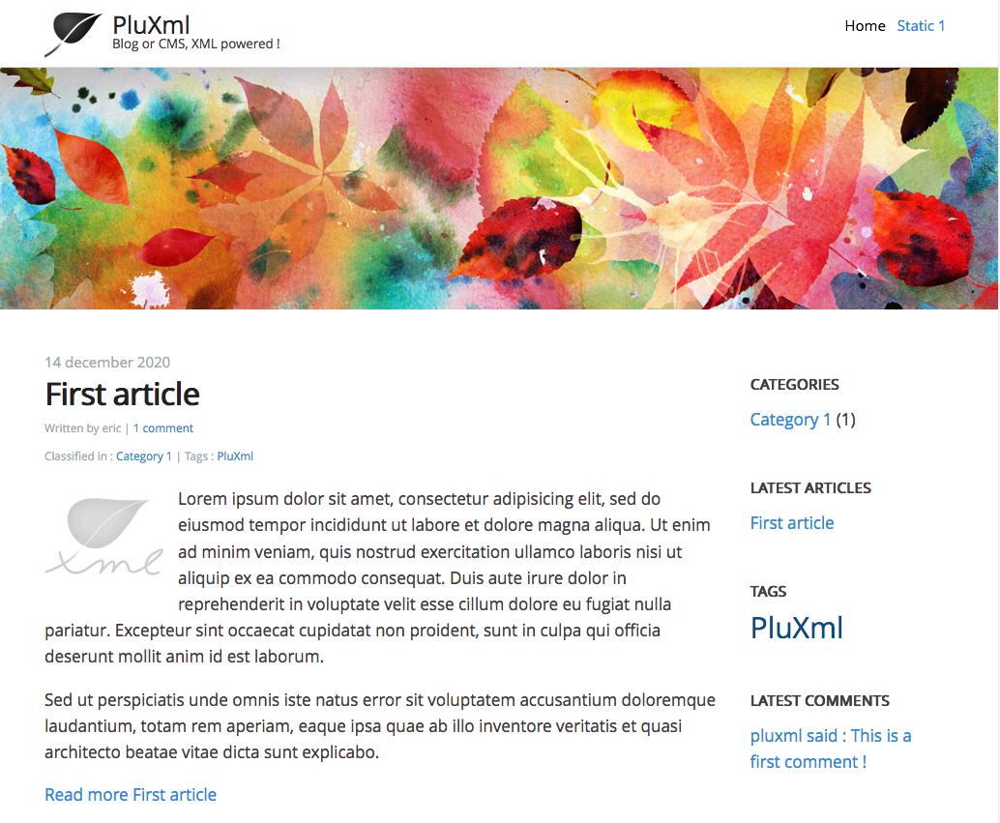

# PluXml pour YunoHost

[](https://dash.yunohost.org/appci/app/pluxml)    
[](https://install-app.yunohost.org/?app=pluxml)

*[Read this readme in english.](./README.md)* 

> *Ce package vous permet d'installer PluXml rapidement et simplement sur un serveur YunoHost.  
Si vous n'avez pas YunoHost, consultez [le guide](https://yunohost.org/#/install) pour apprendre comment l'installer.*

## Vue d'ensemble
PluXml est un système de gestion de contenu développé en PHP. Les données sont stockées dans des fichiers XML. Il n'est donc pas nécessaire de disposer du système de gestion de base de données. PluXml est personnalisable par l'intermédiaire de thèmes et/ou de plugins.

**Version incluse:** 5.8.5

## Captures d'écran



## Démo

* [Official demo](https://demo.pluxml.org/)

## Configuration

Le panneau d'administration est accessible via https://domain.tld/path/core/admin

## Documentation

 * Documentation officielle : https://wiki.pluxml.org/
 * Documentation YunoHost : https://yunohost.org/#/app_pluxml_fr

## Caractéristiques spécifiques YunoHost

#### Support multi-utilisateur

* L'authentification LDAP et HTTP est-elle prise en charge ? **Non**  
* L'application peut-elle être utilisée par plusieurs utilisateurs ? **Oui**

#### Architectures supportées

* x86-64 - [](https://ci-apps.yunohost.org/ci/apps/pluxml/)
* ARMv8-A - [](https://ci-apps-arm.yunohost.org/ci/apps/pluxml/)

## Limitations

* Limitations connues.

## Informations additionnelles

* Autres informations à ajouter sur cette application

## Liens

 * Signaler un bug : https://github.com/YunoHost-Apps/pluxml_ynh/issues
 * Site de l'application : https://www.pluxml.org/
 * Dépôt de l'application principale : https://github.com/pluxml/PluXml
 * Site web YunoHost : https://yunohost.org/

---

## Informations pour les développeurs

Merci de faire vos pull request sur la [branche testing](https://github.com/YunoHost-Apps/pluxml_ynh/tree/testing).

Pour essayer la branche testing, procédez comme suit.
```
sudo yunohost app install https://github.com/YunoHost-Apps/pluxml_ynh/tree/testing --debug
ou
sudo yunohost app upgrade pluxml -u https://github.com/YunoHost-Apps/pluxml_ynh/tree/testing --debug
```
